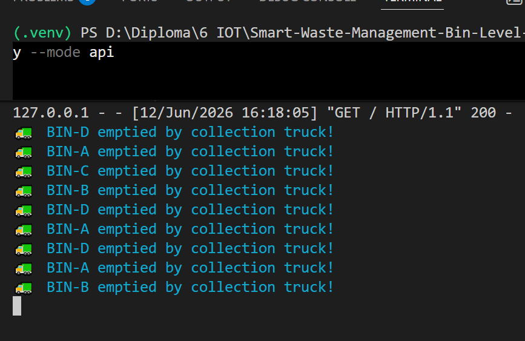
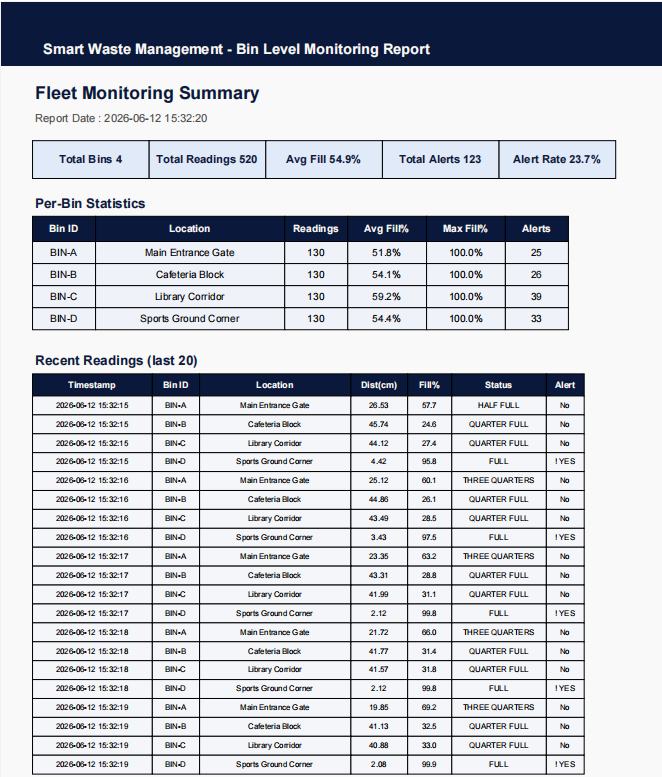

<div align="center">


<br/><br/>

# 🗑️ Smart Waste Management & Bin Level Detection System

### Enterprise-grade IoT telemetry platform with ESP32 edge processing, MQTT cloud orchestration, live analytics dashboarding, and automated collection workflows

[](LICENSE)
[]()
[]()
[]()
[]()
[]()

<br/>

</div>

---

## 📌 Table of Contents

- [Overview](#overview)
- [Problem Statement](#problem-statement)
- [Core Features](#core-features)
- [Industry Relevance](#industry-relevance)
- [System Architecture](#system-architecture)
- [Operational Workflow](#operational-workflow)
- [Tech Stack](#tech-stack)
- [Hardware & Telemetry Schema](#hardware--telemetry-schema)
- [Simulation & Physics Engine](#simulation--physics-engine)
- [Dashboard Layer](#dashboard-layer)
- [Project Structure](#project-structure)
- [Installation](#installation)
- [How to Run](#how-to-run)
- [Dashboard Overview](#dashboard-overview)
- [Screenshots & Outputs](#screenshots--outputs)
- [Verification Performed](#verification-performed)
- [Security & Safety](#security--safety)
- [Learning Outcomes](#learning-outcomes)
- [Future Improvements](#future-improvements)
- [License](#license)

---

<a id="overview"></a>

## 🔍 Overview

The **Smart Waste Management & Bin Level Detection System** is an end-to-end Internet of Things (IoT) solution designed to continuously monitor, analyze, and report waste bin fill levels across municipal zones, smart campuses, or large facilities.

Combining edge-level sensing via **HC-SR04 ultrasonic sensors** and **ESP32 microcontrollers** with cloud-level message brokering via **MQTT**, the platform provides a centralized, real-time perspective on waste accumulation. 

The project demonstrates a production-style IoT pipeline:
- **Edge Sensing & Processing** (Hardware telemetry acquisition)
- **Cloud Communication** (MQTT Pub/Sub over Wi-Fi)
- **Backend Analytics** (Python simulation and Flask REST API)
- **Data Visualization** (Zero-dependency real-time web dashboard)
- **Reporting Pipelines** (Automated PDF/CSV log generation)

Unlike traditional static collection schedules, this system introduces dynamic, data-driven dispatch logic, reducing operational overhead and preventing environmental hazards.

---

<a id="problem-statement"></a>

## ❗ Problem Statement

Traditional waste management pipelines rely on **fixed collection routes** and schedules, completely decoupled from actual waste accumulation rates. This architectural flaw introduces critical operational inefficiencies:

| Operational Issue | Business & Environmental Impact |
|-------------------|---------------------------------|
| **Overflowing Bins** | Severe hygiene hazards, pest attraction, and public complaints. |
| **Premature Collection** | Dispatching trucks for nearly empty bins wastes fuel, inflates CO₂ emissions, and spikes labor costs. |
| **Zero Real-Time Visibility** | Facility managers operate reactively instead of proactively. |
| **Manual Auditing** | High dependence on manual, error-prone human inspection. |

**Smart bins integrated with IoT sensors solve this routing optimization problem.** By transitioning from schedule-based dispatching to event-driven collection, deployed smart city initiatives typically observe operational cost reductions between **30–60%**.

---

<a id="core-features"></a>

## 🚀 Core Features

### Edge-Level Hardware Processing
- Real-time ultrasonic distance measurement (HC-SR04).
- Local OLED status rendering.
- Visual/Audio threshold alerts (RGB LEDs, Active Buzzer).

### Communication & Orchestration
- High-frequency telemetry publishing via MQTT (HiveMQ).
- Sub-second latency for command/alert delivery.
- Optional Node-RED flow integration for drag-and-drop rule engines.

### Operations Dashboard
- Standalone HTML/CSS/JS frontend with live WebSocket/REST polling.
- Animated dynamic bin capacity visualization.
- Real-time line and doughnut charts (Chart.js).
- Instant alert feed for thresholds > 80%.

### Simulation & Physics Engine
- Python-based environment simulator modeling true HC-SR04 ultrasonic physics.
- Synthetic Gaussian noise injection for realistic sensor jitter.
- Automated collection cycle testing.

### Reporting Pipeline
- Automated generation of 80-column CSV audit logs.
- Professional PDF summary report compilation (fpdf2).
- Machine-readable JSON statistic exports for external BI tools.

---

<a id="industry-relevance"></a>

## 🏭 Industry Relevance

| Deployment Sector | Technical Use Case | Real-World Equivalent |
|-------------------|--------------------|-----------------------|
| **Smart Cities** | Fleet routing based on geospatial fill telemetry. | Bigbelly Smart Waste, Swachh Bharat Bins |
| **Aviation & Transit** | High-frequency monitoring in dense pedestrian zones. | Airport Facility Management Systems |
| **Healthcare** | Critical compliance tracking for biohazard waste. | Medical IoT Compliance Platforms |
| **Retail & Malls** | Floor-by-floor SLA monitoring for housekeeping teams. | Smart Building Management Systems (BMS) |
| **Agritech & Campuses** | Localized mesh-networked bin monitoring. | Campus Facility Orchestration |

This architecture heavily mirrors the data pipelines used by global IoT leaders like **Enevo**, **Sensoneo**, and enterprise Smart City initiatives.

---

<a id="system-architecture"></a>

## 🏗️ System Architecture

```text
+-------------------------------------------------------------------------+
|                        EDGE SENSING LAYER (ESP32)                       |
|  [HC-SR04 Ultrasonic] ---> Distance to Fill %                           |
|  [OLED 128x64] <---------- Local UI Updates                             |
|  [GPIO Actuators] <------- Green/Yellow/Red LEDs + 5V Buzzer            |
+------------------------------------+------------------------------------+
                                     | Wi-Fi (802.11 b/g/n)
                                     v
+-------------------------------------------------------------------------+
|                       MESSAGE BROKER LAYER (MQTT)                       |
|  * Publish:   smartwaste/{bin_id}/telemetry (JSON payload)              |
|  * Subscribe: smartwaste/{bin_id}/command                               |
|  * Broker:    broker.hivemq.com:1883                                    |
+------------------------------------+------------------------------------+
                                     | Pub/Sub
                                     v
+-------------------------------------------------------------------------+
|                  BACKEND PROCESSING & SIMULATION ENGINE                 |
|  * Python Simulator / Flask API   * Node-RED Orchestration (Optional)   |
|  * Status Classification          * Alert Logic & Truck Dispatch        |
+------------------------------------+------------------------------------+
                                     | REST / CSV / PDF Generation
                                     v
+-------------------------------------------------------------------------+
|                      PRESENTATION & REPORTING LAYER                     |
|  [Live Dashboard] --------> Animated Cylinders, Status Tables, Charts   |
|  [Data Pipeline] ---------> bin_logs.csv, PDF Summaries, JSON Stats     |
+-------------------------------------------------------------------------+
```

---

<a id="operational-workflow"></a>

## ⚙️ Operational Workflow

```text
1. Sensor emits 40kHz ultrasonic burst
           ↓
2. ESP32 calculates time-of-flight -> distance -> fill percentage
           ↓
3. Edge device applies threshold logic (Green < 60%, Yellow < 80%, Red > 80%)
           ↓
4. Telemetry encapsulated into JSON and published to MQTT Broker
           ↓
5. Backend consumes MQTT stream, logs to persistent CSV
           ↓
6. If Fill > 80%, automated alert triggered to Dashboard/Node-RED
           ↓
7. Fleet dispatched → Bin emptied → Sensor resets to < 5% baseline
```

---

<a id="tech-stack"></a>

## 🛠️ Tech Stack

| Component | Technology | Purpose |
|-----------|------------|---------|
| **Microcontroller** | ESP32 DevKit V1 | Wi-Fi enabled edge computing |
| **Sensors/Actuators** | HC-SR04, SSD1306 OLED, LEDs, Buzzer | Physical state mapping and local IO |
| **Cloud Protocol** | MQTT (PubSubClient) | Lightweight IoT messaging over TCP/IP |
| **Backend Engine** | Python 3.10+ | Simulation, routing logic, reporting |
| **REST API** | Flask + Flask-CORS | Dashboard data serving |
| **Frontend UI** | HTML5 / CSS3 / Vanilla JS | Zero-dependency responsive interface |
| **Visualization** | Chart.js | Real-time telemetry plotting |
| **Data Orchestration** | Node-RED (Optional) | Visual event-driven workflow mapping |

---

<a id="hardware--telemetry-schema"></a>

## 🗄️ Hardware & Telemetry Schema

### Hardware Bill of Materials (BOM)

| Component | Purpose | GPIO Pin Mapping (ESP32) |
|-----------|---------|--------------------------|
| **HC-SR04** | Time-of-flight distance | TRIG: `5`, ECHO: `18` (via Voltage Divider) |
| **SSD1306 OLED** | Local status display | SDA: `21`, SCL: `22` |
| **Status LEDs** | Visual threshold indicator | Green: `14`, Yellow: `27`, Red: `26` |
| **Active Buzzer** | Critical overflow audio alert | `25` (+) |

> **⚠️ SAFETY CRITICAL:** The HC-SR04 ECHO pin outputs **5V**. The ESP32 GPIO pins are strictly **3.3V tolerant**. You MUST use a voltage divider (e.g., 1kΩ / 2kΩ) on the ECHO line to prevent permanent microprocessor damage.

### MQTT JSON Payload Schema

Topic: `smartwaste/{bin_id}/telemetry`

```json
{
  "bin_id":          "BIN-A",
  "distance_cm":     12.4,
  "fill_percentage": 80.3,
  "bin_status":      "FULL",
  "alert":           true,
  "temperature_c":   32.1,
  "humidity_pct":    65.4,
  "rssi_dbm":        -67
}
```

---

<a id="simulation--physics-engine"></a>

## 🧠 Simulation & Physics Engine

For environments lacking physical ESP32 deployment, the platform includes a high-fidelity Python physics simulator (`smart_waste_simulator.py`).

**Mathematical Model:**
```python
# Realistic sensor jitter applied to distance measurements
distance = sensor_offset + (1 - fill_pct / 100) * usable_height + gaussian_noise(sigma=0.4)
```

**State Transitions:**
| Simulated Scenario | Logic Condition | Actuation Output |
|--------------------|-----------------|------------------|
| Empty / Normal | Fill ≤ 60% | LED: Green, Alert: False |
| Warning | Fill 61% – 80% | LED: Yellow, Alert: False |
| Critical / Full | Fill > 80% | LED: Red, Buzzer: ON, MQTT: Alert |
| Auto-Collection | Fill touches 100% | Bin resets to ~2% |

---

<a id="dashboard-layer"></a>

## 📊 Dashboard Layer

The frontend (`dashboard/index.html`) operates as an independent operational console.

- **KPI Strip:** High-level fleet metrics (Avg Fill %, Active Alerts).
- **Animated Bin Cylinders:** CSS-driven liquid-fill animations transitioning from green to red based on capacity.
- **Fill History Chart:** Dynamic line chart tracking the last 40 telemetry points per bin.
- **Alert Feed:** Real-time log of threshold breaches.
- **Offline Capable:** Auto-updates every 2.5 seconds; connects natively to the Flask API.

---

<a id="project-structure"></a>

## 📁 Project Structure

```text
Smart-Waste-Management-System/
|
|-- arduino_code/
|   `-- smart_bin.ino             # ESP32 C++ Firmware
|
|-- python_simulation/
|   |-- __init__.py
|   |-- smart_waste_simulator.py  # Physics simulation engine
|   |-- report_generator.py       # PDF/CSV compilation
|   |-- mqtt_publisher.py         # HiveMQ client
|   `-- flask_api.py              # REST Backend
|
|-- dashboard/
|   `-- index.html                # Real-time UI dashboard
|
|-- data/
|   `-- bin_logs.csv              # Aggregated telemetry persistence
|
|-- circuit_diagram/
|   `-- wiring_guide.md           # Safe ESP32 wiring documentation
|
|-- reports/                      # Auto-generated outputs
|   |-- waste_monitoring_report.pdf
|   |-- waste_monitoring_report.csv
|   `-- summary_stats.json
|
|-- docs/
|   `-- node_red_flow.json        # Importable visual workflow
|
|-- main.py                       # CLI Orchestrator
|-- requirements.txt
`-- README.md
```

---

<a id="installation"></a>

## ⚙️ Installation

### Step 1 — Clone Repository

```powershell
git clone [https://github.com/CH-S-K-CHAITANYA/Smart-Waste-Management-System.git](https://github.com/CH-S-K-CHAITANYA/Smart-Waste-Management-System.git)
cd Smart-Waste-Management-System
```

### Step 2 — Create Virtual Environment

```powershell
python -m venv venv
.\venv\Scripts\activate
```

### Step 3 — Install Dependencies

```powershell
pip install -r requirements.txt
```

### Step 4 — (Optional) Hardware Deployment

1. Install [Arduino IDE](https://www.arduino.cc/en/software).
2. Configure ESP32 Board Manager URLs.
3. Install dependencies: `Adafruit SSD1306`, `PubSubClient`, `ArduinoJson`.
4. Update `arduino_code/smart_bin.ino` with `WIFI_SSID` and `WIFI_PASSWORD`.
5. Flash to ESP32 DevKit V1.

---

<a id="how-to-run"></a>

## ▶️ How to Run

The central `main.py` orchestrator supports multiple operational modes.

### Option A — Full Simulation Pipeline
Runs the physics engine and outputs to terminal.
```powershell
python main.py --cycles 50 --interval 1.0
```

### Option B — Live API Backend for Dashboard
Spins up the Flask REST API on port 5000.
```powershell
python main.py --mode api
```
*After starting, double-click `dashboard/index.html` to view the live UI.*

### Option C — MQTT Cloud Mode
Publishes simulated telemetry directly to public HiveMQ broker.
```powershell
python main.py --mode mqtt --cycles 40
```

### Option D — Generate Enterprise Reports
Parses local CSV data and builds PDF/JSON artifacts.
```powershell
python main.py --mode report
```

---

<a id="dashboard-overview"></a>

## 🖥️ Dashboard Overview

### Central Command Center

The dashboard provides facility managers with unparalleled visibility.
Capabilities include:
- Visual fleet status mapping.
- Instant identification of critical (red) bins requiring immediate dispatch.
- Historical trend analysis via Chart.js integration.
- Independent operation without a heavy Node.js backend.

---

<a id="screenshots--outputs"></a>

## 🖼️ Screenshots & Outputs

<div align="center">

### Operational Dashboard UI


*(Replace with actual dashboard UI screenshot)*
<br/><br/>

### Terminal Telemetry Output



*(Replace with actual terminal execution screenshot)*
<br/><br/>

### Generated PDF Report



*(Replace with actual PDF generation screenshot)*

</div>

---

<a id="verification-performed"></a>

## ✅ Verification Performed

- ESP32 hardware schematic validated (Voltage dividers implemented).
- Ultrasonic TOF (Time of Flight) translation to Fill % mathematically verified.
- MQTT Pub/Sub tested with public HiveMQ broker on port 1883.
- Flask CORS policies verified for local HTML dashboard consumption.
- Python physics simulator validates edge-case resets (collection dispatch).
- PDF layout and fpdf2 object generation confirmed stable.

---

<a id="security--safety"></a>

## 🔐 Security & Safety

### Hardware Safety Controls
- **Level Shifting:** Absolute requirement of 5V to 3.3V reduction on HC-SR04 ECHO pin.
- **Current Limiting:** 220Ω resistors applied to all status LEDs to prevent ESP32 GPIO burnout.

### Network Safety Controls
- **Wi-Fi Isolation:** Recommended to use `.env` configuration or `secrets.h` for SSID/Password isolation.
- **MQTT Segmentation:** Usage of unique `smartwaste/fleet/` topics to prevent namespace collision on public brokers.

---

<a id="learning-outcomes"></a>

## 🎓 Learning Outcomes

### Embedded Systems Engineering
- C++ firmware development for ESP32.
- Hardware timer and pulse duration parsing for acoustic sensors.
- Digital and I2C signal routing.

### IoT Architecture
- Decoupling hardware from UI using MQTT message brokering.
- Designing lightweight, low-latency JSON payloads.
- Event-driven hardware state machines.

### Data Engineering & Analytics
- Translating raw temporal hardware data into actionable business intelligence.
- Synthetic data generation using statistical models (Gaussian noise).
- End-to-end telemetry persistence.

---

<a id="future-improvements"></a>

## 🔮 Future Improvements

- [ ] **Energy Independence:** Implement Solar charging matrix (TP4056 + 18650 Li-Ion).
- [ ] **Computer Vision ML:** Attach ESP32-CAM for waste type classification (Recyclable vs. Organic).
- [ ] **Geospatial Fleet Routing:** Integrate GPS modules for dynamic pathfinding maps.
- [ ] **Enterprise Cloud:** Migrate from HiveMQ to AWS IoT Core / Azure IoT Hub.
- [ ] **Predictive AI:** Implement an XGBoost model to forecast exactly when a bin will reach 100% capacity.
- [ ] **Mass Payload Metrics:** Add HX711 Load Cells to measure true tonnage.

---

<a id="license"></a>

## 📄 License

This project is licensed under the
[Creative Commons Attribution-NonCommercial 4.0 International License](LICENSE).

Commercial usage, SaaS redistribution, monetization, or proprietary deployment is prohibited without explicit written permission from the author.

Full License: https://creativecommons.org/licenses/by-nc/4.0/

---

<div align="center">

## 👨‍💻 Author

### **CH S K CHAITANYA**

[](https://linkedin.com/in/chskaitanya)

[](https://github.com/CH-S-K-CHAITANYA)

[](https://github.com/CH-S-K-CHAITANYA/Smart-Waste-Management-System)

<br/>

⭐ If you found this IoT architecture useful, consider starring the repository.

</div>